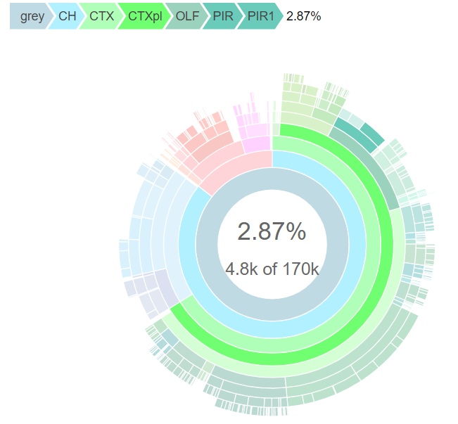
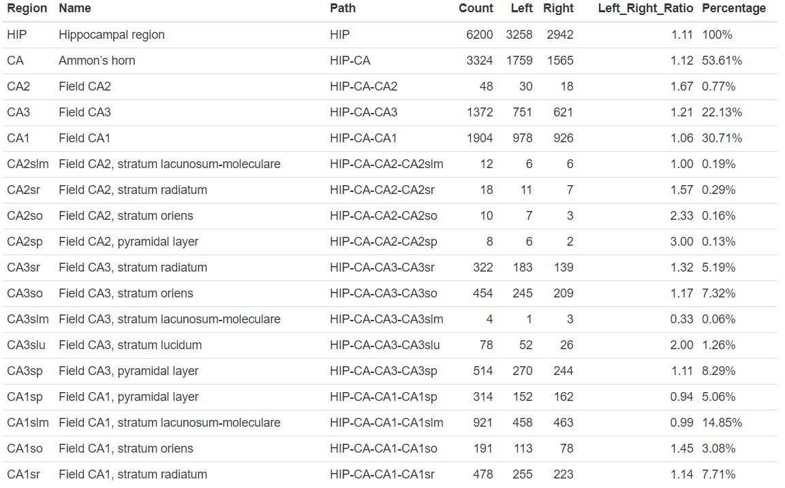
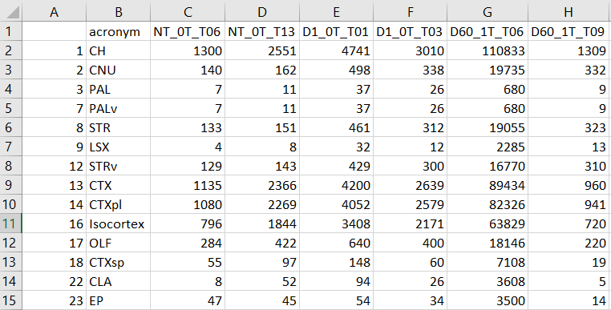
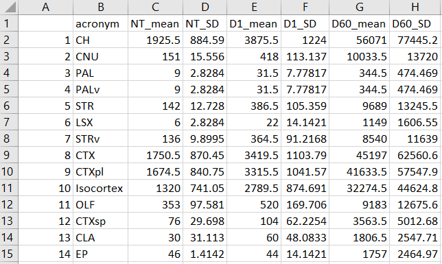
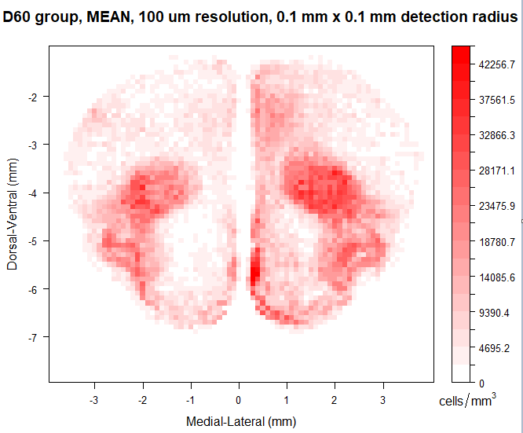
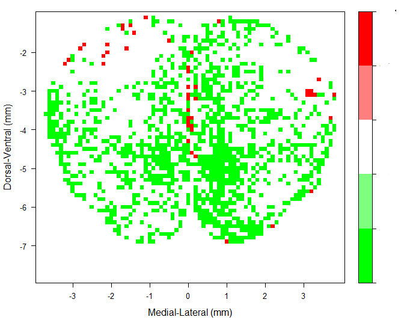

# Tutorial

## Pipeline breakdown:

For processing a wholebrain dataset, the pipeline is split into 6 sections. These sections are listed below along with the functions that belong to each section:

**Part 1: Setup pipeline**

  - `setup_pl()` User friendly way to setup parameters for whole
    or partial brain pipeline analysis.
  - `im_sort()` A function to sort image paths for imaging
    datasets.
  - `get_savepaths()` Generate savepaths and save directories.

**Part 2: Alignment (W)**

  - `choice()` **(W)** User friendly choice game to align
    internal reference atlas plates.
  - `brainmorph()` **(W)** Generate a brain morph plot.
  - `interpolate()` **(W)** Interpolate all AP and z numbers for
    atlas plates in a whole brain project.

**Part 3: Registration**

  - `registration2()` Console user interface built on top of
    registration() function from the wholebrain package.
  - `regi_loop()` Automatically loops through the image
    registration process for the imaging dataset.

**Part 4: Segmentation, duplicate cleanup, & forward warping**

  - `filter_loop()` Loops through reference slices and allows
    user to check/change filter settings for segmentation or
    registration.
  - `seg_loop()` Loop through and segments images in the
    segmentation channel.
  - `clean_duplicates()` **(W)** Duplicate cell count clean up
    of segmentation output.
  - `cell_counter()` Determines total number of cells
    segmented, retained, and removed by duplicate cleanup.
  - `forward_warp()` Performs forward warp loop back onto atlas
    space using segmentation and registration output.

**Part 5. Dataset manipulation and plotting**

  - `isolate_dataset()` Isolates a user-specified subset of
    the forward warped dataset.
  - `get_rois()` Gets a subset of the forward warped dataframe
    of just regions of interest.
  - `get_sunburst()` Generates a sunburst plot using a forward
    warped dataset.
  - `get_tree()` Creates a dataframe of hierarchical region
    cell count data.
  - `glassbrain2()` Generates a 3D plot of cells counts with
    option of removing glassbrain in the background.
  - `get_table()` Generates a dataframe showing region
    acronyms, their full name, hierachical paths, total cell counts,
    left and right counts, and cell count percentages.

**Part 6. Aggregating data from multiple analyses**

  - `concatenate()` Combines datasets from multiple brains.
  - `cell_count_compilation()` Compiles cell counts from
    multiple brains.
  - `get_groups()` Compiles group data from individual brains.
  - `voxelize()` Generate voxel-based heatmaps from multiple
    brains.
  - `voxel_stats()` Run statistical tests on voxel-based
    heatmaps.

Below is a walkthrough of each of these functions and the pipeline as a whole using an example whole brain dataset.

## Part 1: Setup pipeline ##

This sections sets up analysis parameters, sorted image paths, and generates savepaths and directories for the rest of the pipeline.

**Step 1.**

`setup_pl()` This function asks the user for setup information. Based on input from the user, the function returns a list of parameters for either a whole or partial brain analysis.

```diff
# Scroll to the details section of the help page to see the setup parameters
?setup_pl()

# Run setup_pl, enter parameter information to the console, 
# and store the output list into a variable named setup

setup <- setup_pl()

# Check or modify your setup parameters 
setup <- setup_pl(setup)

# Note: Whenever a different user works on analyzing the same dataset,
# run the above command to change user initials. This will keep track of
# who did what. 
```

### Tips: When providing folder paths, do not put quotes around the path to the console input.

For convention, sequential image numbers are z image numbers, even for a partial brain analysis. Z image number should start at 1 and end at the number of images. Image files should start indexing at 1 in the filenames to match image number.

For a whole brain analysis, the first and last atlas plates must be qualitatively aligned with the first and last z image numbers. Note that the `setup$internal_ref_z`, `setup$regi_AP`, `setup$regi_z` parameters are not user modifiable and will be NULL until the `choice()` or `interpolate()` functions are run.

Additionally, there are a few default pipeline parameters for whole brain analysis:
- Spacing between registrations (mm). DEFAULT: 0.100
- Segmentation step (integer). DEFAULT: 1.
- AP coordinates of internal reference planes. DEFAULT: 1.91, 1.10, -.42, -0.93 , -1.94 , -2.95, -3.96.

The above coordinates correspond to PFC, NAc, antHyp, start of HIP, posterior Hyp, VTA, and the PAG, respectively. These coordinates will be the atlas plates used to “calibrate” to internal z images. They’ll be used to interpolate and match the z images of remaining atlas plates. They were chosen because:

1) Based on our experience, they contain easy internal region landmarks that can be consistently identified by different users
2) They are somewhat evenly spaced throughout the brain.

However, these coordinates are user modifiable to account for user preference and varying AP ranges of imaging datasets. If you are using this pipeline for the first time, I recommend you take the default values.

The console code below shows the setup list I am using:

```diff
# Check setup list

> setup <- setup_pl(setup)

Your animal ID         :  1602
Your initials          :  MJ
Your registration path :  D:/output_R15_1602_SG_Rein_NoTest_coronal/R15_1602_SG_Rein_NoTest_coronal_final_C02_betterrotation
Your segmentation path :  D:/output_R15_1602_SG_Rein_NoTest_coronal/R15_1602_SG_Rein_NoTest_coronal_final_C01_betterrotation
Your output path       :  D:/SMART_example_data/output
Your z spacing         :  0.0025
Your registration step :  0.1
Your segmentation step :  1
Your first AP          :  2.82
Your first z           :  200
Your last AP           :  -4.77
Your last z            :  2925
Your internal reference AP coordinates:  1.91 1.1 -0.42 -0.93 -1.94 -2.44 -2.95 -3.45 -3.96
Please review your setup information above:
Do you want to change any settings: Y/N?

```

---

**Step 2.**

`im_sort()` User friendly way to sort images from the registration channel. Asks for user input to account for flexible naming conventions for images.

```diff
# Sort images and store them 

# There will be user walk through for the 'separator' 
# and 'position' information necessary to sort images 
setup <- im_sort(setup, extension = "tif")

# Note: Setting the position argument will skip the user walkthrough. 
# e.g.
setup <- im_sort(setup, extension = "tif", position = 9)

# Check image_paths
setup$image_paths
```

---

**Step 3.**

`get_savepaths()` Create standardized save directories based on the setup information from `setup_pl()`. setup is returned with setup$savepaths filled containing savepaths to subfolders in the output folder.

```diff
# Create savepaths and generate data subdirectories automatically 
setup <- get_savepaths(setup)

# Check the output folder to see the subdirectories created!

# Show savepaths generated
setup$savepaths

# To save the global environment at any time during an analysis session run: 
save.image(setup$savepaths$envir_savepath)

# Going to the R_data folder in the output folder and clicking on the 
# .RData folder by date will revert the global environment back to a previous session.
# Saving everyday will prevent you from losing more than a day's worth of work.
```

### Tip: rerun the save.image() expression to update the global environment savepath every day.

Below shows my console output for my savepaths variable:

```diff
# Update and show savepaths

> setup <- get_savepaths(setup)
> setup$savepaths
$`envir_savepath`
[1] "D:/SMART_example_data/output/R_data/Animal_1602_2019-01-20_MJ.RData"

$out_reference_aligned
[1] "D:/SMART_example_data/output/Reference_aligned"

$out_RC_brain_morph
[1] "D:/SMART_example_data/output/RC_brain_morph"

$out_auto_registration
[1] "D:/SMART_example_data/output/Registrations_auto"

$out_registration
[1] "D:/SMART_example_data/output/Registrations_manual"

$out_registration_warps
[1] "D:/SMART_example_data/output/Registration_warps"

$out_segmentation_warps
[1] "D:/SMART_example_data/output/Segmentation_warpimages"

$out_segmentation_schem
[1] "D:/SMART_example_data/output/Segmentation_schematics"
```

## Part 2: Alignment (W)

This section is necessary for whole brain datasets only. Users first “calibrate” the reference atlas plates with their appropriate z image number by running `choice()` and playing the choice game. Based on the aligned reference plates, the user can match all remaining atlas plates with an interpolated z image using `interpolate()`.

**Step 4.**

`choice()` **W** User friendly way to play the wholebrain choice game to align internal reference atlas plates. Automatically saves images of chosen aligned images in the folder specified by `setup$savepaths$out_reference_aligned`.

Below is my initial console output when I run `choice()` with my setup variable.

```diff
# Run the choice game and save the aligned 
# z reference number back into the setup list:

> setup <- choice(setup, filetype = "tif") # save chosen images as tifs
Play the choice game!
Your reference AP is 1.91 
Your current image sampling choice_step is  200 

Which image matches best?
Enter 1, 2 or 3:
```

**How the choice game works:**

The choice game will cycle through the internal reference atlas plates (represented below by dotted vertical lines). Three choice windows will popup for each reference AP coordinate, corresponding to choices 1,2 or 3, respectively. The user simply compares the corresponding atlas plate with the 3 choice windows and enters the best qualitative match.

<p align="center">

<br>
<b>Internal reference atlas plates</b>
</p>

The middlemost window (choice 2) is SMART’s best guess at the z image best aligned with the atlas coordinate based on the first and last aligned atlas plates (represented above by solid vertical lines).

<p align="center">

<br>
<b>Display and prompt</b>
</p>

### Note: The default positions the windows pop up on screen can be set by the `xpos` argument.

The current `choice_step` indicates how many z images the anteriormost (choice 1) or posteriormost (choice 3) images are from the middlemost image (choice 2). Entering 1, 2 or 3 into the console has three outcomes:

1) **Choice 1** The anteriormost image becomes the new choice 2 on the next choice option.
2) **Choice 2** On the next choice option, there is a smaller `choice_step` on the left and right images. Choosing this option will progressively “zoom in” on the `choice_step` options until the steps can’t get smaller. The choice game will then move on to the next atlas coordinate. By default, the smallest step is 10.
3) **Choice 3** The posteriormost image becomes the new choice 2 on the next choice option.

### Note: the `choice_step` progression is a user modifiable argument.

<p align="center">

<br>
<b>Midpoint quality check</b>
</p>

Once all the internal references atlas coordinates have been aligned, you can cycle through the midpoint AP coordinates of the aligned references as a quality check (represented above with black arrows). After comparing midpoints, any unsatisfactory midpoints become another internal reference point. The choice game automatically is replayed for those midpoints.

Below shows my code to run the midpoint check:

```diff
# Run the midpoint check 
> setup <- choice(setup, midpoint = TRUE, filetype = "tif")
```

The following image represents the console and popup window display during the midpoint check.

<p align="center">

<br>
<b>Midpoint quality check display</b>
</p>

Below are my internal reference AP coordinates and z numbers after running `choice()` and checking midpoints with my analysis setup:

```diff
# Check internal reference AP numbers
> setup$internal_ref_AP
[1]  1.9060687  1.0969084 -0.4202672 -0.9259924 -1.9374427 -2.4431679 -2.9488931 -3.4546183 -3.9603435

# Check matched image z numbers
>  setup$internal_ref_z
[1]  526  850 1492 1658 1950 2141 2402 2623 2723
```

If you are unsatisfied later with a few internal reference coordinate alignments, you can replay the choice game for just those points by setting them as a vector to the [touchup] argument. The code below replays the choice game for only coordinates 1.91 and -0.42 (double digit entries are fine):

```diff
# redo internal AP points 1.91 & -0.42
> setup <- choice(setup, touchup = c(1.91, -0.42 ))
```

---

`brainmorph()` **(W)** Generate a brain morph plot showing areas of relative expansion or compression along the AP axis compared to the Allen Mouse Brain Atlas AP coodinates (normalized to 1). The reference atlas points used to generate the morph plot are plotted in red. Setting `saveplot = TRUE` will save the brain morph into the data folder designated by `setup$savepaths$out_RC_brain_morph`.

```diff
# Generate brainmorph. 
brainmorph(setup, saveplot = FALSE)
```

<p align="center">

<br>
<b>Brainmorph plot</b>
</p>

---

**Step 5.**

`interpolate()` **W** This function interpolates all corresponding z and AP values for atlas plates that are not reference plates.

```diff
# Interpolate all remaining atlas plates and their z number
setup <- interpolate(setup)
```

Now checking the setup list will show all matched internal AP plates and z numbers:

```diff
> setup$regi_AP
 [1]  2.81637405  2.71522901  2.61408397  2.51293893  2.41179389  2.31064885  2.20950382  2.10835878  2.00721374
[10]  1.90606870  1.80492366  1.70377863  1.60263359  1.50148855  1.40034351  1.29919847  1.19805344  1.09690840
[19]  0.99576336  0.89461832  0.79347328  0.69232824  0.59118321  0.49003817  0.38889313  0.28774809  0.18660305
[28]  0.08545802 -0.01568702 -0.11683206 -0.21797710 -0.31912214 -0.42026718 -0.52141221 -0.62255725 -0.72370229
[37] -0.82484733 -0.92599237 -1.02713740 -1.12828244 -1.22942748 -1.33057252 -1.43171756 -1.53286260 -1.63400763
[46] -1.73515267 -1.83629771 -1.93744275 -2.03858779 -2.13973282 -2.24087786 -2.34202290 -2.44316794 -2.54431298
[55] -2.64545802 -2.74660305 -2.84774809 -2.94889313 -3.05003817 -3.15118321 -3.25232824 -3.35347328 -3.45461832
[64] -3.55576336 -3.65690840 -3.75805344 -3.85919847 -3.96034351 -4.06148855 -4.16263359 -4.26377863 -4.36492366
[73] -4.46606870 -4.56721374 -4.66835878 -4.76950382


> setup$regi_z
 [1]  200  236  272  309  345  381  417  454  490  526  566  607  648  688  728  769  810  850  893  936  978 1021
[23] 1064 1107 1150 1192 1235 1278 1321 1364 1406 1449 1492 1525 1558 1592 1625 1658 1687 1716 1746 1775 1804 1833
[45] 1862 1892 1921 1950 1988 2026 2065 2103 2141 2193 2245 2298 2350 2402 2446 2490 2535 2579 2623 2643 2663 2683
[67] 2703 2723 2748 2774 2799 2824 2849 2875 2900 2925
```

## Part 3: Registration

This section automates looping through through and registering all atlas plates to images from the registration channel. It also allows for easy modification of registrations.

`registration2()` **(O)** Provides a user friendly interface to alter registrations. It retains the same arguments from the registration() function in wholebrain. This function may be useful for those who already have their own established analysis pipelines. Check out the function help page for more details.

<p align="center">

<br>
<b>Registration interface</b>
</p>

The schematic above illustrates the user-friendly console interface that allows for modification of the correspondence plates on a given atlas plate. The `regi_loop()` function integrates this user-friendly registration interface with the pipeline.

---

**Step 6.**

`regi_loop()` User friendly function to alter atlas to image registration. When run with defaults, this function will automatically create a list in the global environment called `regis`. It will loop through the atlas plates according to the user preferences. The user also has the option to save the global environment after every manual registration.

```diff
# Example run of automated registration loop

# Create filter for registration
filter <- structure(list(alim = c(50, 50),
                           threshold.range = c(50000, 60000L),
                           eccentricity = 999L,
                           Max = 1000,
                           Min = 150,
                           brain.threshold = 270L,
                           resize = 0.25,
                           blur = 7L,
                           downsample = 2))

# Run the autoloop
regi_loop(setup, autoloop = TRUE, filter = filter)
```

### Note: The function `filter_loop()` allows the user to modify the filter for registration or segmentation and loop through the references plates to check filter adjustments in images across the brain.

There are four different loop options:

1) `autoloop = TRUE` runs wholebrain’s first pass at registering all atlas plates. Registrations are stored in the Registrations_auto folder. This is useful to check the quality of registrations across all atlas plates using current filter settings.
2) `reference = TRUE` loops through reference atlas plates only and displays the console interface.
3) The `touchup` argument is designed to edit a subset of atlas plates that have been previously registered. This argument requires referencing atlas plate numbers, not AP coordinates. Plate numbers can be easily found in the file names of the images saved to the ‘Registrations_manual’ folder in the output folder.
- `touchup = TRUE` runs a user friendly interface allowing user to enter which plates they want to fix.
- `touchup =` Numeric vector of plate numbers (integers) the user wants to fix.
4) Setting all the arguments above to `FALSE` will loop through all atlas plates and display the console interface.

### Tip: Save the global environment after every 2-3 registrations. The save time lengthens significantly as more registrations are stored in the `regis` list.

Once the `regi_loop()` function has been run for the first time, the `regis` argument must be set to the `regis` list automatically generated in the global environment.

For example:

```diff
# Loop through and modify only reference atlas plates
regi_loop(setup, regis = regis, filter = filter, reference = TRUE)
```

Below is an example of a registration before and after manual improvement:

<p align="center">

<br>
<b>After auto-registration</b>
</p>

<p align="center">

<br>
<b>After registration correction</b>
</p>

## Part 4: Segmentation, duplicate cleanup, & forward warping

This section loops through all the images of the segmentation channel and automates the forward looping process. At the end of this section, you will have a mapped dataset!

**Step 7.**

`filter_loop()` This function takes a registration or segmentation filter and loops through all images in a partial brain or just the reference images in either the registration or segmentation channel. The `wholebrain::segment()` function is used to display the segmentation output. There is a console menu option for the user to adjust filter parameters if they need.

```diff
# Check and modify filter settings in the segmentaion channel
filter <- filter_loop(setup, channel = "seg")
```

An explanation of the filter parameters according to WholeBrain documentation is provided below:
- **alim:** a two scalar integer vector with minimum and maximum allowed soma area size in pixels. threshold.range: a two scalar integer vector with minimum and maximum fluorescent intensity to iteratively search for soma in.
- **max:** single integer value that determines what maximum pixel intensity to render in 8-bit rendering mode.
- **min:** single integer value that determines what minimum pixel intensity to render in 8-bit rendering mode. brain.threshold: single integer value sets the segmentation of brain outline used for registration later on.
- **blur:** integer value with added blur of brain section outline. Default is 4, increase if you have damaged tissue at the edges.
- **resize:** positive numeric value indicates matching of atlas to brain section. Increase to make atlas (orange outlines in registration) smaller, decrease to make it larger. If too small atlas wont fit image and registration will not start. Usual range 0.3 - 0.9.
- **downsample:** downsampling to save computational time (default 0.25).

---

**Step 8.**

`seg_loop()` This function loops through the z images in the segmentation folder path. For a whole brain, every N images is segmented, where N is equal to `setup$seg_step`. For a partial brain, all the images in `setup$regi_z` are segmented.

```diff
# Run segmentation loop and store the output
segs <- seg_loop(setup, filter)
```

### Note: If the imaging dataset is large, steps 8, 9, & 10 will be time intensive processes. Processing time will be printed after each of these functions are finished.

---

**Step 9.**

`clean_duplicates()` **(W)** Duplicate cell count clean up of segmentation output from the `seg_loop()` function. This step is only necessary for large imaging datasets where the z step size is smaller than the width of a cell body.

```diff
# Clean duplicate cell counts 
segs <- clean_duplicates(setup, segs, z_thresh = 10, compare_depth = 200)

# z_thresh - Threshold (in um) in the z-plane for the maximum z distance 
# before a cell is counted as another cell.

# compare_depth -  Comparision depth in (um). Compare a single image with adjacent 
# images up to 200 um posterior.
```

---

`cell_counter()` **(W)** Determines total number of cells segmented, retained, and removed by duplicate cleanup. This is useful to determine the efficacy of `clean_duplicates()`.

```diff
> cell_counter(segs)
[1] "Retained cells by plate: 1212, 445, 463, 515, 517, 509, 494, 477, 459, 493, 442, 466, 478, 471, 472, 461, 445, 
429, 432, 472, 470, 426, 447, 460, 454, 405, 451, 482, 452, 440, 456, 457, 497, 400, 478, 475, 444, 459, 434, 454, 
472, 456, 437, 469, 444, 425, 482, 465, 476, 447, 447, 495, 495, 485, 477, 470, 501, 452, 447, 471, 401, 484, 428, 
455, 458, 449, 413, 443, 440, 431, 425, 424, 439, 423, 428, 435, 448, 473, 411, 430, 449, 445, 376, 463, 411, 414, 
436, 423, 403, 426, 377, 413, 413, 383, 428, 418, 404, 442, 425, 435, 422, 405, 422, 461, 450, 443, 377, 443, 422, 
465, 518, 1053"
[1] "Removed cells by plate: 793, 1570, 1570, 1531, 1517, 1522, 1483, 1455, 1488, 1452, 1515, 1457, 1433, 1455, 
1477, 1485, 1472, 1497, 1481, 1463, 1464, 1476, 1484, 1464, 1470, 1514, 1461, 1440, 1451, 1488, 1476, 1441, 1438, 
1509, 1447, 1475, 1475, 1493, 1483, 1440, 1438, 1463, 1503, 1492, 1481, 1524, 1494, 1507, 1505, 1548, 1579, 1547, 
1567, 1554, 1565, 1546, 1521, 1529, 1491, 1491, 1538, 1465, 1500, 1479, 1462, 1411, 1448, 1442, 1410, 1418, 1421, 
1441, 1418, 1406, 1422, 1401, 1413, 1415, 1454, 1411, 1431, 1413, 1466, 1373, 1468, 1422, 1389, 1415, 1415, 1362, 
1423, 1387, 1393, 1406, 1357, 1387, 1431, 1428, 1439, 1393, 1453, 1499, 1469, 1429, 1475, 1471, 1517, 1447, 1456, 
1427, 1403, 831"
[1] "214209 total cells segmented"
[1] "51509 total cells retained"
[1] "162700 total cells removed"
```

---

**Step 10.**

`forward_warp()` **(W)** Loop through all segmented cells and perform forward warp loop back onto atlas space using registration and segmentation data. There are user options for plotting a schematic plot and saving forward warp images. The function will automatically interpolate AP coordinate values of z images in between atlas plates and assign them to the dataset.

```diff
# Perform forward warp
dataset <- forward_warp(setup, segs, regis)
```

Below are representative forward warp and schematic images:

<p align="center">

<br>
<b>Forward warp image</b>
</p>

<p align="center">

<br>
<b>Schematic plot</b>
</p>

### Note: `forward_warp()` will automatically clean up any cell counts that aren’t assigned a region ID.

## Part 5: Dataset manipulation and plotting:

Following Step 10, there are no more steps in the pipeline. The remaining functions are designed for easy manipulation and plotting of the dataset.

`isolated_dataset()` **(O)** Isolate a user-specified subset of the forward warped dataset. The user may use any or all of the available parameters they choose to isolate their cells of interest. An explanation of the `isolate_dataset()` parameters is provided below:

- **start_AP** (default = NULL) Most anterior AP to retain cells.
- **end_AP** (default = NULL) Most posterior AP to retain cells.
- **hemisphere** (default = "B") Hemisphere to retain cells from ("L", "R", or "B").
- **plates** (default = c(1:length(unique(dataset$image)))) Vector of registration plates to retain plates from; specify plate numbers relative to the first registration plate in the current analysis.
- **mirror** (optional, default = FALSE) Boolean to specify whether all cells will be mirrored across the midline.
- **flip** (optional, default = FALSE) Boolean to specify whether all cells will be flipped across the midline.
- **bounds** (optional, default = c()) Vector to specify whether cells within a circular or rectangular area should be retained. For circles, the vector should be formatted as: c("circle", ML-center, DV-center, radius). For rectangles, the vector should be formatted as: c("rectangle", ML-top-left-corner, DV-top-left-corner, width, height).
- **rois** (optional, default = c("grey")) Vector to specify regions of interest to retain cells from.

```diff
isolated_dataset <- isolate_dataset(setup, dataset, start_AP = 1.71, end_AP = 1.81, hemisphere = "L", plates = c(2), mirror = FALSE, flip = FALSE, bounds = c("circle", 0, -4, 3), rois = c("CH"))
```

---

`get_rois()` **(O)** Allows the user to enter a character vector of Allen Mouse Brain Atlas abbreviations of regions of interest (ROIs). A subset of the dataframe from the wholebrain dataset of just the ROIs (and their subregions) are returned.

`get_rois()` is especially useful in plotting cell count tables of regions of interest:

```diff
# Get dataset of just rois
rois <- get_rois(dataset, rois = c("ACB", "CEA", "BLA", "HIP"))

# Plot region cell counts in a table
quartz()
wholebrain::dot.plot(rois)
```

<p align="center">

<br>
<b>Region plot</b>
</p>

---

`get_sunburst()` **(O)** Generate a sunburst plot using a forward warped dataset.

```diff
# Plot sunburst plot using the get_sunburst() function
SMART::get_sunburst(dataset)
```

<p align="center">

<br>
<b>Sunburst plot</b>
</p>

Click [here](https://smartrpackage.shinyapps.io/smart_sample_dataset/) for an interactive sunburst plot.

### Note: By setting the `rois` argument, the sunburst will display only ROI data. If the `parent` argument is set to `FALSE`, the base layer in sunburst will be the first ROI.

---

`get_tree()` **(O)** Create a dataframe of hierarchical region cell count data.

The code below generates a dataframe of the hierarchy tree for the hypothalamus:

```diff
# Hierarchical dataframe of just the hypothalamus
tree <- get_tree(dataset, rois = "HY")
View(tree)
```

### Note: this dataframe may be useful for generating other heirarchical plots such as [treemaps](https://github.com/cran/treemap).

---

`glassbrain2()` **(O)** A modified version of `wholebrain::glassbrain()`. New options include:

1) Gives the user an option to turn off the “jitter” in cell placement in original glassbrain function (the jitter gives a more space filled look).
2) Does not show the glass brain display when `high.res` is set to “OFF” (otherwise set to TRUE or FALSE). Setting high.res to TRUE or FALSE will render a high or low resolution atlas boundary

```diff
# Generate rgl object and plot glassbrain without 3D atlas boundaries
glassbrain <- glassbrain2(dataset, high.res = "OFF", jitter = FALSE) 

# visualize glass brain 
glassbrain
```

Click [here](https://smartrpackage.shinyapps.io/smart_sample_dataset/) for an interactive glasssbrain.

---

`get_table()` **(O)** Generates a dataframe showing region acronyms, their full name, hierachical paths, total cell counts, left and right counts, and cell count percentages.

```diff
# Example usage:
# Get data table displaying cell counts from Ammon's horn
table <- get_table(dataset, rois = "CA", base = "HIP")
View(table)

# Setting the base argument to "HIP" changes the count percentage to be out of the entire hippocampal formation
# Change base to "CA" bases the percentage counts off cell counts in Ammon's horn exclusively
# Change base and rois to "grey" to get all cell counts of grey matter in the brain
```

The table below is representative of the dataframe displayed:

<p align="center">

<br>
<b>Data table</b>
</p>

## Part 6. Aggregating data from multiple analyses

The tables and plots generated in Part 5 are designed for use with one brain. The following functions allow the user to aggregate data from multiple brains.

`concatenate()` Combines datasets from multiple brains into one large group dataset. This aggregate dataset can be visualized through the functions in Part 5.

```diff
group_dataset <- concatenate(data_list = c("D:/2021-02-25_1.7_1.6_All_RData_Files/Animal_0T_T06_2021-02-25_OD.RData",
                                           "D:/2021-02-25_1.7_1.6_All_RData_Files/Animal_0T_T13_2021-02-25_MB.RData",
                                           "D:/2021-02-25_1.7_1.6_All_RData_Files/Animal_0T_T15_2021-02-25_JDN.RData",
                                           "D:/2021-02-25_1.7_1.6_All_RData_Files/Animal_0T_T18_2021-02-25_OD.RData"),
                             datasets = c("isolated_dataset", "isolated_dataset", "isolated_dataset", "isolated_dataset"))
```

---

`cell_count_compilation()` Compiles cell counts from multiple brains into a .csv file. The user can specify which regions and subregions to include in the compilation file.

```diff
cell_count_table <- cell_count_compilation(regions = c("CH"), subregions = 3, clean_zeros = TRUE, hierarchy_level = FALSE,
                                           datasets = c("isolated_dataset", "isolated_dataset", "isolated_dataset", 
                                                        "isolated_dataset", "isolated_dataset", "isolated_dataset"),
                                           files_list = c("D:/2021-02-25_1.7_1.6_All_RData_Files/Animal_0T_T06_2021-02-25_OD.RData",
                                                          "D:/2021-02-25_1.7_1.6_All_RData_Files/Animal_0T_T13_2021-02-25_MB.RData",
                                                          "D:/2021-02-25_1.7_1.6_All_RData_Files/Animal_0T_T01_2021-02-25_JDN.RData",
                                                          "D:/2021-02-25_1.7_1.6_All_RData_Files/Animal_0T_T03_2021-02-25_OD.RData",
                                                          "D:/2021-02-25_1.7_1.6_All_RData_Files/Animal_1T_T06_2021-02-25_OD.RData",
                                                          "D:/2021-02-25_1.7_1.6_All_RData_Files/Animal_1T_T09_2021-02-25_OD.RData"),
                                           brains_list = c("NT_0T_T06", "NT_0T_T13", "D1_0T_T01", "D1_0T_T03", "D60_1T_T06", "D60_1T_T09"),
                                           output = "C:/Users/nguyenjd/Desktop/JDN Files/SMART Files/2021-03-30 Compilation.csv")
```

The output is the following table:

<p align="center">

<br>
<b>Cell Counts</b>
</p>

---

`get_groups()` Compiles group data from individual brains. Using the output of `cell_count_compilation()`, this function gives the mean and standard deviations for every region for every group.

```diff
group_table <- get_groups(input = "C:/Users/nguyenjd/Desktop/JDN Files/SMART Files/2021-03-30 Compilation.csv",
                          brains_list = c("NT_0T_T06", "NT_0T_T13", "D1_0T_T01", "D1_0T_T03", "D60_1T_T06", "D60_1T_T09"),
                          groups_list = c("NT", "NT", "D1", "D1", "D60", "D60"),
                          groups = c("NT", "D1","D60"),
                          output = "C:/Users/nguyenjd/Desktop/JDN Files/SMART Files/2021-03-30 Groups.csv")
```

The output is the following table:

<p align="center">

<br>
<b>Group Means and Standard Deviations</b>
</p>

---

`voxelize()` Generates voxel-based heatmaps from multiple brains. For each test group, this function outputs a heatmap for every brain, a group mean heatmap, and a group standard deviation heatmap (to isolate spots with the most variable cell counts). For each heatmap, the function also outputs the data into a .csv file and an R object called `group_matrices`.

```diff
group_matrices <- voxelize(brains_list = c("NT_0T_T06", "NT_0T_T13", "D1_0T_T01", "D1_0T_T03", "D60_1T_T06", "D60_1T_T09"),
                           data_list = c("D:/2021-02-25_1.7_1.6_All_RData_Files/Animal_0T_T06_2021-02-25_OD.RData",
                                         "D:/2021-02-25_1.7_1.6_All_RData_Files/Animal_0T_T13_2021-02-25_MB.RData",
                                         "D:/2021-02-25_1.7_1.6_All_RData_Files/Animal_0T_T01_2021-02-25_JDN.RData",
                                         "D:/2021-02-25_1.7_1.6_All_RData_Files/Animal_0T_T03_2021-02-25_OD.RData",
                                         "D:/2021-02-25_1.7_1.6_All_RData_Files/Animal_1T_T06_2021-02-25_OD.RData",
                                         "D:/2021-02-25_1.7_1.6_All_RData_Files/Animal_1T_T09_2021-02-25_OD.RData"),
                           datasets = c("isolated_dataset", "isolated_dataset", "isolated_dataset", 
                                        "isolated_dataset", "isolated_dataset", "isolated_dataset"),
                           groups_list = c("NT", "NT", "D1", "D1", "D60", "D60"),
                           groups = c("NT", "D1", "D60"), ML_bounds = c(-4, 4), DV_bounds = c(-8, -1), 
                           detection_bounds = c(0.1, 0.1), resolution = 10, heatmaps = TRUE, save = TRUE,
                           output = "C:/Users/nguyenjd/Desktop/JDN Files/SMART Files/heatmaps")
```

A sample output is below:

<p align="center">

<br>
<b>Sample Group Mean Heatmap</b>
</p>

### Note: To produce heatmaps that contain cells only belonging to one registration plate, run `isolate_dataset()` before `voxelize()`.

---

`voxel_stats()` Runs statistical tests on voxel-based heatmaps. This function uses a two-tailed t-test at every point to determine group differences.

```diff
stat_matrix <- voxel_stats(input = "C:/Users/nguyenjd/Desktop/JDN Files/SMART Files/heatmaps/group_matrices_100_um_voxels.RData", 
                           group_matrices = group_matrices, groups = c("D1", "D60"), ML_bounds = c(-4, 4), DV_bounds = c(-8, -1), 
                           p_value = 0.05, output = "C:/Users/nguyenjd/Desktop/JDN Files/SMART Files")
```

A sample output is below. Green dots indicate group 2 (D60) being higher, red dots indicate group 1 (D1) being higher.

<p align="center">

<br>
<b>Sample Voxel Statistics</b>
</p>
